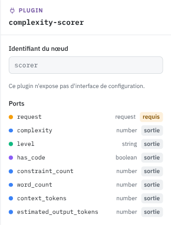

# complexity-scorer

> Plugin livré par défaut, famille « Analyse de la requête ». Retour à la [vue d'ensemble des nœuds](../index.md).

**complexity-scorer** évalue la difficulté de la demande courante. Sorties : `complexity` (number entre 0 et 1), `level` (string, de `trivial` à `very_complex`), `has_code` (boolean), `constraint_count`, `word_count`, `context_tokens`, `estimated_output_tokens` (number).

Le score porte sur le dernier message utilisateur, pas sur tout l'historique. Une conversation longue et banale n'est pas une demande difficile. La taille de l'historique sort à part dans `context_tokens`. Le score monte avec les contraintes explicites (format, longueur, ton, sources), les demandes de raisonnement (prouver, comparer, concevoir), la présence de code et la structure du texte. Une salutation vaut moins de 0,05, une analyse comparative avec tableau et recommandation environ 0,8.
