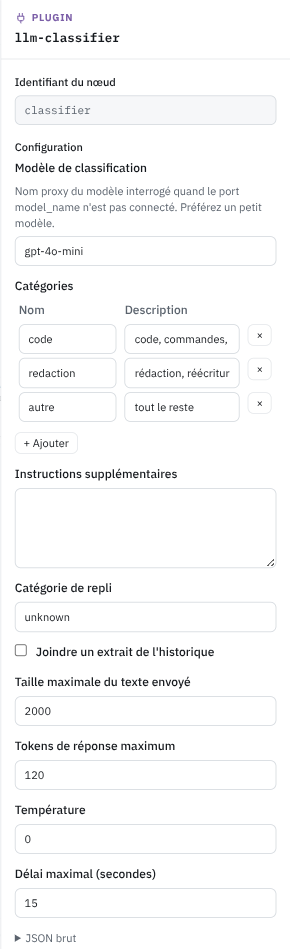

# llm-classifier

> Plugin livré par défaut, famille « Analyse de la requête ». Retour à la [vue d'ensemble des nœuds](../index.md).

**llm-classifier** pose la question à un modèle de l'organisation, via la passerelle.

## Ports

| Port | Sens | Type | Requis |
| --- | --- | --- | --- |
| `request` | entrée | request | oui |
| `model_name` | entrée | string | non |
| `category` | sortie | string | — |
| `reason` | sortie | string | — |
| `error` | sortie | string | — |
| `confidence` | sortie | number | — |

## Configuration

| Champ | Rôle | Défaut |
| --- | --- | --- |
| `model` | Modèle interrogé quand `model_name` n'est pas connecté |  |
| `categories` | Catégories, un nom et une phrase de description chacune |  |
| `instructions` | Instructions supplémentaires ajoutées au prompt de classification |  |
| `fallback_category` | Catégorie de repli | `unknown` |
| `include_history` | Joindre un extrait de l'historique | `false` |
| `max_context_chars` | Taille maximale du texte envoyé | 2000 |
| `max_tokens` | Tokens de réponse maximum | 120 |
| `temperature` | Température | 0 |
| `timeout_seconds` | Délai maximal en secondes | 15 |

## En pratique

La phrase de description de chaque catégorie fait tout le travail. On peut trier par sujet, par service, par sensibilité, par ce qu'on veut. Choisissez un petit modèle. L'appel s'ajoute à la latence de chaque requête, et il n'est ni décompté du quota ni enregistré dans l'usage. En cas d'échec, `category` prend la valeur de repli et `error` explique pourquoi.
